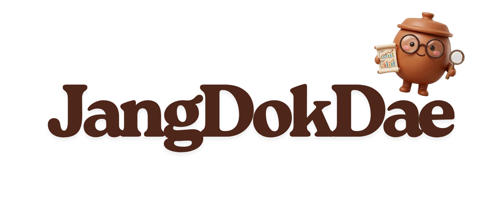

<div align="center">




 [클라이언트 저장소](https://github.com/9990-jangdokdae/jangdokdae-client) · [서버 저장소](https://github.com/9990-jangdokdae/jangdokdae-server)
</div>

---

## 1. 프로젝트 개요

### 소개

**장독대(JangDokDae)** 는 주식 입문자(주린이)를 위한 AI 기반 금융 뉴스 큐레이션 · 학습 서비스입니다.

> 시**장** **독**해를 **대**신 해드린다는 뜻을 담고 있습니다.

금융 뉴스를 자동 수집하고 임베딩·클러스터링으로 이슈를 그룹화한 뒤, LangGraph 멀티 에이전트가 분석·번역·퀴즈를 생성합니다. 
복잡한 시장 뉴스를 누구나 읽을 수 있도록 풀어내고, 짧은 퀴즈로 학습까지 이어지는 것을 목표로 합니다.

### 배경

매일 수백 건의 금융 뉴스가 쏟아지지만, 주식 입문자가 그 맥락을 파악하기는 쉽지 않습니다.

> 전문 용어로 가득 찬 기사, 흩어진 정보, 학습으로 이어지지 않는 1회성 소비

**장독대**는 이 세 가지 문제를 한 번에 해결합니다.

뉴스를 자동으로 수집·클러스터링하고 LLM으로 분석해, 초보 투자자도 이해할 수 있는 언어로 변환합니다. 핵심 용어 해설과 퀴즈를 통해 읽는 것에서 배우는 것으로 이어집니다.

---

## 2. 팀원 소개

<table>
  <tr>
    <td align="center" width="25%" valign="top">
      <br/><br/>
      <b>김민경</b><br/><br/>
      <sub>PM</sub><br/>
      <sub>시스템 아키텍처 설계</sub><br/>
      <sub>FastAPI · Route 설계</sub><br/>
      <sub>뉴스 데이터 수집 · 전처리</sub><br/>
      <sub>OAuth 로그인</sub><br/>
      <sub>UI/UX 온보딩</sub>
    </td>
    <td align="center" width="25%" valign="top">
      <br/><br/>
      <b>이수범</b><br/><br/>
      <sub>데이터 수집 파이프라인 설계</sub><br/>
      <sub>기업 데이터 수집</sub><br/>
      <sub>전처리</sub><br/>
      <sub>DB 설계</sub><br/>
      <sub>Server CI/CD</sub>
    </td>
    <td align="center" width="25%" valign="top">
      <br/><br/>
      <b>장원기</b><br/><br/>
      <sub>뉴스 분석 파이프라인 설계</sub><br/>
      <sub>DB 설계</sub><br/>
      <sub>API 설계</sub>
    </td>
    <td align="center" width="25%" valign="top">
      <br/><br/>
      <b>박영기</b><br/><br/>
      <sub>주린이 번역 & 퀴즈</sub><br/>
      <sub>주식 용어 사전</sub><br/>
      <sub>UI/UX</sub><br/>
      <sub>Frontend CI/CD</sub>
    </td>
  </tr>
</table>

---

## 3. 기술 스택

| 분류 | 기술 |
|------|------|
| **백엔드** |     |
| **데이터베이스** |   |
| **AI / ML** |       |
| **프론트엔드** |     |
| **인증** |    |
| **인프라** |    |

---

## 4. 주요 기능

| 기능 | 설명 |
|------|------|
| 📰 **이슈 클러스터링** | 비슷한 뉴스를 자동으로 묶어 하나의 이슈로 제공 |
| 🤖 **AI 분석** | LangGraph 워크플로우로 이슈 요약 · 영향 분석 생성 |
| 📖 **주린이 번역** | 어려운 금융 용어를 쉬운 설명으로 자동 변환 |
| 🧠 **퀴즈** | 이슈별 O/X · 선택형 퀴즈로 이해도 확인 |
| 📚 **주식 용어 사전** | 핵심 금융 용어를 툴팁으로 즉시 확인 |
| 🔍 **RAG 검색** | 사업보고서 · 재무제표를 벡터 DB로 검색해 정확한 분석 근거 제공 |
| 📊 **마켓 지수** | 코스피 · 코스닥 실시간 시황 |
| 🔐 **소셜 로그인** | 카카오 · 구글 OAuth 2.0 |

---

## 5. 빠른 시작

### 사전 요구사항

- Python 3.12+, [uv](https://docs.astral.sh/uv/)
- Node.js 20+
- PostgreSQL (또는 [Neon](https://neon.tech))

### 서버

```bash
git clone https://github.com/9990-jangdokdae/jangdokdae-server.git
cd jangdokdae-server

cp .env.example .env
uv sync
psql $DATABASE_URL -f apps/scripts/db/create_table.sql
uv run uvicorn apps.main:app --reload --port 8000
```

API 문서: `http://localhost:8000/docs`

### 클라이언트

```bash
git clone https://github.com/9990-jangdokdae/jangdokdae-client.git
cd jangdokdae-client

cp .env.example .env.local
npm install
npm run dev
```

개발 서버: `http://localhost:3000`

### 파이프라인 실행

```bash
# 전체 데이터 파이프라인
uv run python apps/scripts/collector_pipeline.py

# Issue Docent 생성
uv run python apps/scripts/generate_issue_docents.py --limit 5
uv run python apps/scripts/generate_issue_docents.py --cluster-id 14 --force
```

> **⚠️ 주의** PyKrx는 장중(09:00–15:30) 실행 금지

---

## 6. 환경 변수

| 변수 | 설명 |
|------|------|
| `DATABASE_URL` | PostgreSQL 연결 문자열 |
| `GEMINI_API_KEY` | Google Gemini API 키 |
| `OPENAI_API_KEY` | OpenAI API 키 |
| `OPENDART_API_KEY` | DART OpenAPI 인증키 |
| `KRX_ID` / `KRX_PW` | KRX 로그인 계정 |
| `KAKAO_CLIENT_ID` / `KAKAO_CLIENT_SECRET` | 카카오 OAuth |
| `GOOGLE_CLIENT_ID` / `GOOGLE_CLIENT_SECRET` | 구글 OAuth |
| `JWT_SECRET` | JWT 서명 시크릿 |
| `CLIENT_URL` | 프론트엔드 URL (기본: `http://localhost:3000`) |
| `NEXT_PUBLIC_API_BASE_URL` | 백엔드 API 주소 (프론트엔드용) |

각 저장소의 `.env.example`을 참고해 `.env` (서버) / `.env.local` (클라이언트)을 생성하세요.

---

## 7. 배포 방법

### 서버 (Render)

`render.yaml`을 저장소 루트에 포함하면 Render에서 자동 감지합니다.

```bash
# 수동 배포 시
pip install uv && uv sync --frozen --no-dev
uvicorn apps.main:app --host 0.0.0.0 --port $PORT --proxy-headers
```

| 항목 | 값 |
|------|-----|
| 런타임 | Python 3.12 |
| 리전 | Singapore |
| 플랜 | Starter |
| 헬스 체크 | `GET /health` |

### 클라이언트 (Vercel)

GitHub 저장소를 Vercel에 연결하면 `main` 브랜치 푸시 시 자동 배포됩니다.

```bash
# 로컬 빌드 검증
npm run build
```

| 항목 | 값 |
|------|-----|
| 프레임워크 | Next.js |
| 빌드 명령 | `npm run build` |
| 출력 디렉토리 | `.next` |

---

## 8. 디렉토리 구조

### 서버 (`jangdokdae-server`)

```
apps/
├── main.py               # FastAPI 진입점
├── scripts/              # CLI 스크립트 (파이프라인, DB 마이그레이션)
├── data/                 # 파이프라인 출력 (날짜별 JSON)
└── src/
    ├── api/              # 라우터 (auth · users · analysis · issue_docent)
    ├── config/           # DB · 환경변수 · 섹터 설정
    ├── dependencies/     # FastAPI 의존성 (JWT 검증)
    ├── models/           # SQLAlchemy ORM 모델
    ├── repositories/     # DB 조회 · 저장 계층
    ├── schemas/          # Pydantic 스키마
    ├── services/         # 비즈니스 로직
    │   ├── auth/         # OAuth · JWT
    │   ├── collector/    # 뉴스 · 기업 데이터 수집
    │   ├── embedder/     # 임베딩 · 클러스터링
    │   ├── analyzer/     # 분석 서비스
    │   └── contents/     # Issue Docent 서비스
    ├── issue_docent/     # LangGraph 워크플로우 · 프롬프트
    └── utils/
```

### 클라이언트 (`jangdokdae-client`)

```
src/
├── app/
│   ├── page.tsx          # 오늘의 이슈 홈
│   ├── issue-docent/     # 이슈 피드 · 상세 (주린이 번역 · 퀴즈)
│   ├── market/indices/   # 코스피 · 코스닥 지수
│   └── onboarding/       # 온보딩
├── components/           # UI · 기능 컴포넌트
├── hooks/                # 커스텀 훅
├── lib/                  # API 클라이언트 · 유틸리티
├── constants/            # 섹터 · 종목 상수
└── types/                # TypeScript 타입 정의
```

---

## 9. 커밋 컨벤션

| 태그 | 설명 |
|------|------|
| `feat` | 새로운 기능 추가 |
| `fix` | 버그 수정 |
| `refactor` | 코드 리팩토링 |
| `docs` | 문서 수정 |
| `test` | 테스트 추가 · 수정 |
| `chore` | 빌드 · 패키지 설정 변경 |

```bash
git switch -c feature/my-feature
git commit -m "feat: 기능 설명"
# PR → main
```

---

© 2026 9990. All rights reserved. 제공되는 정보는 학습과 시장 이해를 위한 콘텐츠이며, 특정 종목의 매수 또는 매도 권유가 아닙니다.

---
